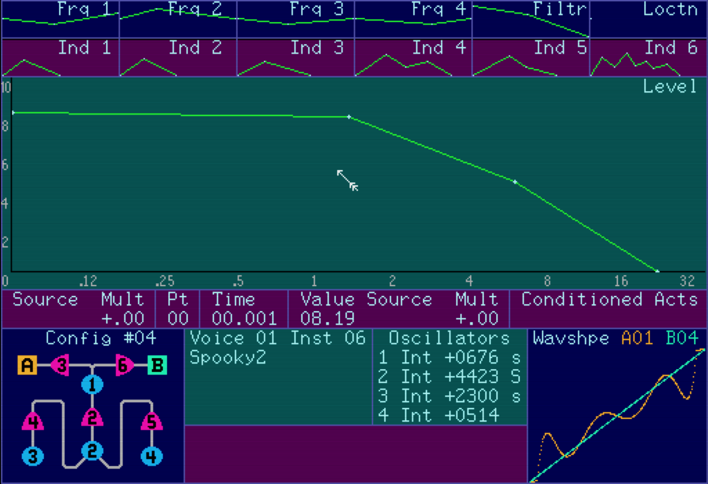
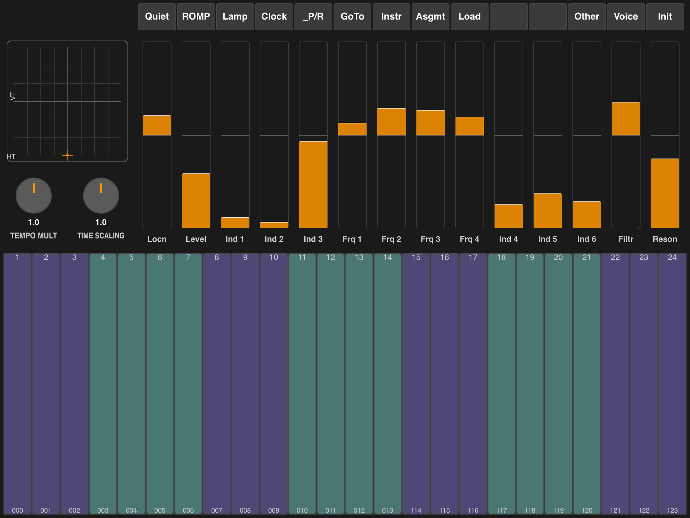

# Buchla 700

A software emulation of the [Buchla 700](https://en.wikipedia.org/wiki/Buchla_electronic_musical_instruments) digital music synthesizer (1989), paired with an iPad touch controller that communicates over OSC.

The project consists of three components:

| Directory | Description |
|-----------|-------------|
| `buchla-emu` | Hardware emulator and DSP engine (C, runs on macOS / Linux / Windows) |
| `buchla-ctl` | iPad touch controller (C++ / JUCE, runs on iPad via Xcode) |
| `buchla-68k` | Original Buchla 700 firmware source (68000 assembly / C) |

## Screenshots

### Emulator (buchla-emu)



The emulator faithfully reproduces the Buchla 700's CRT display, showing envelope curves, bar graph parameter levels, FM configuration routing, oscillator tunings, waveshape previews, and the MIDAS VII editing interface.

### iPad Controller (buchla-ctl)



The iPad controller provides a touch interface with 14 bar-graph faders, 14 mode buttons, an XY pad, tempo/time-scaling knobs, and a 24-key touch keyboard with Y-axis expression.

---

## buchla-emu — Hardware Emulator

A full-system emulator of the Buchla 700 hardware, including:

- **Motorola 68000 CPU** via the Musashi emulation core
- **Intel 82716 video** — CRT display with bar graphs, envelope curves, and text
- **Epson SED1335 LCD** controller
- **Western Digital WD1772** floppy disk controller (720 KB FAT12 images)
- **Rockwell R65C52** dual serial/MIDI ports
- **Motorola MC6840** triple timer
- **Microcontroller** A/D conversion emulation

### Digital Sound Synthesis (DSP)

The emulator includes a complete recreation of the Buchla 700 audio engine running at 48 kHz. All 12 voices are computed every sample with no oversampling.

#### Signal Chain

```
4 Oscillators (phase accumulators)
    → FM Routing (12 configurations, 6 modulation indices)
    → Waveshape Lookup (WSA + WSB tables, 254 entries each, linear interpolation)
    → Mix (×0.2 gain)
    → 4-Pole OTA Ladder Filter (variable cutoff & resonance)
    → DC Blocking Filter (1st-order HPF at ~1.5 Hz)
    → Equal-Power Panning
    → Anti-Click Ramp (64 samples / ~1.3 ms)
    → Level × Dynamics

12 voices summed → Aural Exciter → Phase Shifter → 7-Band Graphic EQ
    → Soft Clamp (±1.0) → Stereo Output
```

#### Oscillators

Each voice has 4 independent oscillators using phase accumulators. Pitch values arrive from the FPU in half-cents and are converted to frequency via `hz = 8.1758 × 2^(pitch/2400)`, where 8.1758 Hz is MIDI C-1. Phase increments are computed as `2π × freq / 48000`.

#### FM Modulation

The 6 index values (Ind1-6) control modulation depth between oscillators. Raw FPU values (±32000) are normalized to ±1.0. The core FM operation is `sin(carrier_phase + modulator × index)`. Each of the 12 configurations defines a different routing topology — see the configurations table below.

#### Waveshaper

Two tables per voice (WSA and WSB), each containing 254 signed 16-bit entries. Input signals are clamped to [-1, +1], mapped to table indices, and linearly interpolated between adjacent entries. Default tables provide a linear identity mapping. The WSA and WSB outputs are summed with a 0.2 gain factor (~-14 dB) before entering the filter.

#### Filter

A 4-pole OTA (Operational Transconductance Amplifier) ladder filter modeled after mid-1980s Buchla analog designs. Uses zero-delay feedback (Zavalishin/Pirkle method) with `tanh()` soft saturation on the differential pair inputs. This provides self-stabilizing resonance with natural limiting — no digital blowup at high Q.

- Cutoff range: 20 Hz to 23,040 Hz (Nyquist × 0.96)
- Resonance range: 0.0 to 0.95 (feedback gain × 4.0, clamped below self-oscillation)
- Bilinear pre-warping ensures accurate cutoff tuning at high frequencies
- Thermal voltage constant (VT = 1.22) controls the saturation knee

#### Panning and Level

Equal-power panning using `cos/sin` quarter-wave curves maintains perceived loudness across the stereo field. Location values from the FPU (-32000 to +32000) map to full left through full right.

Level and dynamics are multiplied together for final voice gain. A 64-sample linear ramp prevents clicks on note onset.

#### Global Effects

Three always-available stereo effects process the mixed output of all 12 voices:

**Aural Exciter** — Extracts the 1-12 kHz band, generates 2nd and 3rd order harmonics via `s² × sign(s) × 2.0 + s³ × 0.5`, applies soft clipping (threshold 0.8), and mixes back with a 0.3 brightness boost. Always active.

**Phase Shifter** — 8-stage cascaded all-pass filter with independent left/right tuning for stereo width. Driven by a blended LFO (70% soft sine + 30% triangle). Three parameters controlled via the front panel "Other" mode:
- Intensity (depth of phase effect)
- Rate (LFO speed, 0.1-5.0 Hz)
- Depth (sweep range)

Coefficients update every 256 samples for CPU efficiency. Base sweep frequencies: 300-3500 Hz (left), 240-2800 Hz (right). Output is 80% wet + 20% dry.

**7-Band Stereo Graphic EQ** — Based on the LMC835 analog IC. Band frequencies: 50, 150, 400, 1k, 2.5k, 6k, 15k Hz. Band 1 is a low-shelf, bands 2-6 are peaking (Q=1.0), band 7 is a high-shelf. Each band provides ±12 dB of independent stereo gain.

#### Parameter Smoothing

All FPU function values are smoothed at audio rate using a one-pole low-pass filter (coefficient 0.05, ~0.4 ms time constant). This prevents zipper noise when parameters change and adapts its rate to the time scaling knob.

### Keyboard Shortcuts

| Key | Action |
|-----|--------|
| `Cmd+F` | Toggle fullscreen |
| `F5` | Open file dialog to swap disk image (macOS only) |
| Drag & drop | Drop a `.disk` file onto the window to swap disk |
| `Escape` | Quit |

### CLI Usage

```
buchla [-h] [-a] [-t] [-v comp [-v comp [...]]] [-b bios] [-d disk] [-f font] [-m port]
```

| Flag | Description |
|------|-------------|
| `-h` | Show help |
| `-a` | Auto-boot MIDAS VII (sends `r` then `go $10000` to the ROMP monitor) |
| `-t` | Play a 440 Hz test tone to verify the audio path |
| `-v comp` | Enable verbose logging for a component (may be repeated). Components: `sdl`, `gdb`, `cpu`, `fpu`, `vid`, `tim`, `lcd`, `ser`, `mid`, `fdd`, `snd`, `led`, `kbd`, `osc`, `all` |
| `-b bios` | BIOS ROM file (default: `bios.abs`) |
| `-d disk` | Disk image file (default: `buchla.disk`) |
| `-f font` | Console and LCD font (default: `vera.ttf`) |
| `-m port` | MIDI port number, 0-15 (default: 0). Use `-m list` to list available ports |

#### Auto-boot example

```sh
cd buchla-emu
./buchla -a
```

This boots directly into MIDAS VII without manual ROMP interaction.

#### Verbose logging example

```sh
./buchla -a -v fpu -v osc
```

Boots MIDAS VII with FPU register and OSC network logging enabled.

### GDB Debugger

A GDB-compatible cross-debugger stub listens on TCP port **12053**, allowing remote debugging of the 68000 firmware with `m68k-none-elf-gdb`.

---

## buchla-ctl — iPad Touch Controller

A JUCE-based iPad application that provides a hardware-style touch interface for the emulator, communicating over OSC (UDP).

### Interface Layout

- **14 bar-graph faders** — Locn, Level, Ind 1-6, Frq 1-4, Filtr, Reson (jog/shuttle style: touch above or below center to move the value)
- **14 mode buttons** — Quiet, ROMP, Lamp, Clock, P/R, GoTo, Instr, Asgmt, Load, Other, Voice, Init
- **XY controller pad** — 2D touch with grid, mapped to HT/VT parameters
- **Tempo Multiplier knob** — 0.5x to 1.5x in 0.1 steps
- **Time Scaling knob** — 0.5x to 1.5x in 0.1 steps
- **24-key touch keyboard** — with Y-axis expression control
- **Three fader modes** — Normal (synth parameters), Other (phase shift / CV), EQ (7-band stereo graphic EQ). Cycle with the Other/EQ/Prmtr button.

### OSC Communication

The iPad controller sends and receives messages on configurable UDP ports (default: send 9001, receive 9002). Both devices must be on the same local network.

---

## Installation

### Prerequisites (all platforms)

- [SDL2](https://www.libsdl.org/) (core)
- [SDL2_net](https://github.com/libsdl-org/SDL_net) (networking / OSC)
- [SDL2_ttf](https://github.com/libsdl-org/SDL_ttf) (font rendering)
- [FreeType](https://freetype.org/) (used by SDL2_ttf)
- [HarfBuzz](https://harfbuzz.github.io/) (used by SDL2_ttf)
- [RtMidi](https://www.music.mcgill.ca/~gary/rtmidi/) (MIDI I/O)

The Makefile supports two modes: **Homebrew dynamic linking** (simplest) or **custom static builds** at `/opt/sdl2` and `/opt/rtmidi` (for self-contained binaries). If `/opt/sdl2/lib/libSDL2.a` exists, static linking is used automatically; otherwise it falls back to Homebrew.

### macOS

```sh
# Install dependencies via Homebrew (Intel or Apple Silicon)
brew install sdl2 sdl2_net sdl2_ttf freetype harfbuzz rtmidi

cd buchla-emu
make
```

**Required files** in `buchla-emu/`:
- `bios.abs` — BIOS ROM (built from `buchla-68k` or provided)
- `midas.abs` — MIDAS VII software
- `vera.ttf` — Bitstream Vera Sans Mono font
- `buchla.disk` — 720 KB FAT12 disk image (created by `make` via `mkdisk`)

Run the emulator:
```sh
./buchla -a          # auto-boot into MIDAS VII
```

### Linux

```sh
# Install build dependencies (Debian/Ubuntu)
sudo apt install build-essential libasound2-dev

# Build SDL2, SDL2_net, SDL2_ttf, freetype, and rtmidi from source
# and install static libraries to /opt/sdl2 and /opt/rtmidi.
# See each library's documentation for ./configure --prefix=/opt/sdl2 etc.

cd buchla-emu
make
```

The Linux build links against ALSA (`-lasound`) for MIDI support.

### Windows (cross-compile from Linux)

The Makefile supports cross-compilation using MinGW:

```sh
# Install cross-compiler
sudo apt install mingw-w64

# Build SDL2, SDL2_net, SDL2_ttf, freetype, and rtmidi for Windows
# and install to /opt/sdl2-win and /opt/rtmidi-win.

cd buchla-emu
make WIN=1
```

This produces `buchla.exe`. Copy it alongside `bios.abs`, `midas.abs`, `vera.ttf`, and `buchla.disk`.

### iPad Controller (buchla-ctl)

Requires macOS with Xcode and an Apple Developer account.

```sh
# JUCE must be available at one of:
#   ./JUCE/            (local copy)
#   ../Taunus/JUCE/    (sibling project)
#   ~/JUCE/            (home directory)

cd buchla-ctl

# Generate Xcode project
cmake -B build_ios -G Xcode \
  -DCMAKE_SYSTEM_NAME=iOS \
  -DCMAKE_OSX_DEPLOYMENT_TARGET=15.0

# Open in Xcode, select your development team, then build & deploy to iPad
open build_ios/BuchlaControl.xcodeproj
```

The iPad and the machine running `buchla-emu` must be on the same local network. The controller auto-discovers the emulator on common local IP addresses.

---

## Building the Firmware (buchla-68k)

The firmware source can be rebuilt with a 68000 cross-toolchain:

```sh
cd buchla-68k
# Requires m68k-none-elf-gcc cross-compiler
make
```

This produces `bios.abs` and `midas.abs` which should be copied into `buchla-emu/`.

---

## Using the Buchla 700

*Adapted from the original 1989 Buchla 700 User's Guide by Buchla and Associates. References to physical hardware controls have been updated for the emulator and iPad controller.*

### Getting Started

1. Launch the emulator: `./buchla -a` (auto-boots into MIDAS VII)
2. If using the iPad controller, ensure both devices are on the same network
3. The emulator window shows the CRT display; the bottom section shows the LCD with button labels and fader assignments

### MIDAS VII Overview

**MIDAS VII** is the Buchla 700's high-level music language. It provides facilities for designing instruments, creating scores, building tuning tables, and managing performance assignments. While simple musical tasks are easily accomplished, the language accommodates increasingly sophisticated instrumental and musical concepts.

MIDAS VII consists of several functional units, each with its own display:

- **Instrument Designer** — Define sounds using oscillators, envelopes, FM routing, waveshaping, and filtering
- **Waveshape Editor** — Create and modify waveshape transfer function tables
- **Tuning Table Editor** — Define custom tuning systems (any scale imaginable)
- **Assignment Table Editor** — Configure voice-to-group mappings, MIDI routing, and keyboard splits
- **Score Editor** — Record, edit, and play back performances with a piano-roll display
- **Patch Editor** — Create alternative performance environments with stimulus-response mappings
- **Sequence Editor** — Program 16 software-based sequencers for repetitive or interactive processes
- **Librarian** — Store and retrieve all data types to and from disk images

### Navigation

| Key / Action | Function |
|-------------|----------|
| **E** (left mouse button) | Enter / Execute / Confirm |
| **M** (right mouse button) | Return to main menu (from any display) |
| **X** | Delete |
| **=** | Add / Enable / Scroll options forward (+) |
| **-** | Decrease / Disable / Scroll options backward (-) |
| **0-9** | Numeric data entry |
| **Mouse** | Move the on-screen cursor (replaces the hardware cursor pad) |

To access any MIDAS function: move the cursor to the desired menu item on the CRT display and press **E**.

### The Librarian

The librarian stores and retrieves data to and from disk images.

**Loading an orchestra:**

1. From the main menu, move the cursor to "Librarian" and press **E**
2. Move the cursor to "Index" and press **E** to view disk contents
3. Set the "Lo/Hi orch" field to choose where instruments load (toggle with **E**)
4. Move cursor to the desired orchestra record and press **E**
5. Confirm the selection and press **E** again to load
6. Press **M** to return to the main menu

**Disk management:**

- Swap disk images at any time using **F5** (macOS file dialog) or drag-and-drop
- The emulator creates a blank 720 KB FAT12 disk image during build (`buchla.disk`)
- Always read the index after swapping disks

### Instrument Designer

The sonic output of the 700 is defined in the instrument designer. Access it from the main menu.

#### Voice Architecture

Each of the 12 voices contains:

- **4 oscillators** — can contribute to output, modulate other elements, or both
- **6 DCAs** (digitally controlled amplifiers) — establish amplitudes and modulation intensities
- **2 waveshape tables** (A and B) — transfer functions for timbral shaping
- **1 four-pole filter** (24 dB/octave) — with cutoff and resonance control
- **1 VCA** — final output level controlled by dynamics

Three types of modulation are available:

| Type | Description |
|------|-------------|
| **A.M.** | Amplitude modulation |
| **F.M.** | Frequency modulation |
| **T.M.** | Timbre modulation (unique to Buchla instruments) |

#### Signal Path

```
4 Oscillators → 6 DCAs (AM/FM/TM via configuration) → Waveshape A/B
    → 24 dB/oct Filter (cutoff + resonance) → VCA (level × dynamics)
    → Output (location, EQ, phase shift, aural excitation) → Stereo Out
```

#### Configurations

**12 configurations** (numbered 00-11) define the interconnection of oscillators, DCAs, and waveshape tables. In configuration diagrams: circles = oscillators, triangles = DCAs, squares = waveshape tables. DCAs connected to the bottom of oscillators route F.M.; DCAs pointing to the sides of other DCAs route T.M.

To change configuration: enter the desired number and press **E**. View all configurations by moving the cursor to "Config" and pressing **E**.

Each configuration routes 4 oscillators (Osc1-4) through 6 index-controlled DCAs (Ind1-6) into two waveshape tables (WSA/WSB). The notation `Osc2→Ind1→Osc1` means Osc2 frequency-modulates Osc1 with depth controlled by Ind1. Side-chain (`+`) means the signal is mixed into the output rather than used as a modulator. `→WSA` and `→WSB` indicate which waveshape table receives the result.

| Config | Routing |
|--------|---------|
| **00** | Symmetric dual-path. WSA: Osc2→Ind1→Osc1, mixed with Osc4×Ind2, scaled by Ind3. WSB: Osc2→Ind4→Osc3, mixed with Osc4×Ind5, scaled by Ind6. Osc2 and Osc4 each modulate both paths. |
| **01** | Split modulators. WSA: Osc2→Ind1→Osc1, with Osc2 side-chain×Ind2, scaled by Ind3. WSB: Osc4→Ind4→Osc3, with Osc4 side-chain×Ind5, scaled by Ind6. Each modulator dedicated to one path. |
| **02** | Cascaded FM with feedback. WSA: Osc3→Ind2→Osc2→Ind1→Osc1, scaled by Ind3. WSB: Osc4→Ind4→Osc3, scaled by Ind6. Osc1→Ind5→Osc4 feedback loop creates complex spectra. |
| **03** | Shared carrier. Osc3 FM-modulates both Osc1 (via Ind2) and Osc2 (via Ind5). Osc4 appears directly in both outputs. WSA: (Osc4 + Osc1×Ind1)×Ind3. WSB: (Osc4 + Osc2×Ind4)×Ind6. |
| **04** | Minimal FM + direct envelope. WSA: Osc2→Ind2→Osc1, scaled by Ind3. WSB: Ind6 alone (pure envelope, no oscillator). Ind1 unused. Osc3, Osc4 computed but not routed to output. |
| **05** | Cross-coupled paths. WSA: Osc4→Ind2→Osc1, mixed with Osc2 side-chain, scaled by Ind3×Ind1. WSB: Osc2→Ind5→Osc3, mixed with Osc4 side-chain, scaled by Ind6×Ind4. |
| **06** | Three-oscillator cascade, dual output. Osc3→Ind1→Osc2→Ind2→Osc1, with Osc4×Ind4 added. Both WSA (×Ind3) and WSB (×Ind6) receive the same signal. Ind5 unused. |
| **07** | Osc4-centric. WSA: Osc4→Ind4→Osc1, scaled by Ind3. WSB: Osc4 with self-modulation×Ind5, scaled by Ind6. Osc2 has Osc4 FM + self-feedback but is not routed to output. Osc3 unused. |
| **08** | Dual-path with feedback. WSA: Osc2→Ind2→Osc1, mixed with Osc3×Ind1, scaled by Ind3. WSB: Osc4 mixed with Osc1×Ind5, scaled by Ind6. Osc3→Ind4→Osc2 feedback alters the FM spectrum. |
| **09** | Circular feedback. WSA: Osc4→Ind1→Osc1, scaled by Ind3. WSB: Osc2→Ind4→Osc3, scaled by Ind6. Osc1→Ind5→Osc4 and Osc3→Ind2→Osc2 form two feedback loops creating chaotic, evolving timbres. |
| **10** | Shared modulator, no feedback. Osc2 FM-modulates both Osc1 (via Ind2) and Osc3 (via Ind5). WSA: Osc1 + Osc3 side-chain×Ind1, scaled by Ind3. WSB: Osc3 + Osc1 side-chain×Ind4, scaled by Ind6. Osc4 unused. |
| **11** | Multi-output with shared carrier. Osc3→Ind5→Osc1 as the main FM pair. WSA: Osc1 + Osc1 raw×Ind1 + Osc4×Ind4, scaled by Ind3. WSB: Osc1 + Osc2×Ind2, scaled by Ind6. Three oscillators contribute as side-chains. |

#### Instrument Library

The 700 stores **40 instrument definitions** organized into two banks:

- **Lo orchestra**: Instruments 1-20
- **Hi orchestra**: Instruments 21-40

Plus a **default instrument** (number 0) that can be played but not edited.

**12 voice slots** hold the instruments you can currently hear and edit. Copy instruments between the library and voice slots freely.

A **red instrument number** warns that the current instrument has unsaved changes.

#### Envelopes

The upper half of the instrument display establishes envelopes for **13 parameters**:

- 4 oscillator pitches (Freq 1-4)
- 6 indices (Index 1-6)
- Filter cutoff frequency
- Stereo location
- VCA level

Envelopes consist of connected time-value segments (up to **128 total points** across all 13 envelopes). Value range: 0 to 10. Time range: 0.001 to 32 seconds, plotted on an exponential scale.

**Graphical editing:**

1. Move cursor near the desired point and press **E** (cursor turns pink)
2. Drag the point to its new position
3. Press **E** to confirm
4. Create new points with **+**, delete with **X** in the "Pt" field

**Conditional actions** can alter envelope playback:

| Action | Effect |
|--------|--------|
| Sustain | Pause at a point while key is held |
| Jump | Loop backwards/forwards a specified number of times |
| Key state | Continue until key changes state |
| Random GoTo | Jump to a random point within a range |

#### Oscillator Pitch Modes

| Mode | Description |
|------|-------------|
| **Frequency** | Fixed frequency (0-15.9 Hz), ignores controller and tuning |
| **Pitch** | Fixed pitch from pedal C to C9 |
| **Interval** | Offset from tuning table pitch in cents (1/100 semitone) |
| **Ratio** | Frequency ratio (e.g., 4/3 = perfect fourth) |

#### Sources and Multipliers

Expressivity comes from mapping **sources** (performance gestures) to parameters via **multipliers**.

| Source | MIDI Controller | iPad Controller |
|--------|----------------|-----------------|
| 1 | Pitch wheel | XY pad horizontal |
| 2 | Modulation wheel | XY pad vertical |
| 3 | Breath controller | — |
| 4 | General purpose controller | — |
| 5 | Pitch/Frequency (derived) | Pitch/Frequency |
| 6 | Key velocity | — |
| 7 | Key pressure (aftertouch) | Key Y-axis |
| 8 | Random | Random |
| 9 | Pedal 1 | — |

**General sources** (far left fields) operate continuously once activated. **Point sources** (per-envelope-point) affect only their associated segment. Points with sources or conditional actions display in **yellow**.

### Waveshape Editor

Access from the main menu. The 700's waveshaping uses **transfer functions** — continuous input functions of varying amplitude pass through the table, producing rich timbral results.

**Three editing methods:**

1. **Point editing** — Move individual points vertically. Adjust brush width with **+**/**-** to affect adjacent points.
2. **Interpolation** — Define inflection points and let MIDAS connect them. Set width to "interp", then place points with **E** and **+**.
3. **Harmonic coefficients** — Specify harmonics directly (values -100 to +100). The magenta line shows the offset waveshape; the green line shows the sum.

**Library:** 20 waveshape tables in memory. Store/fetch by entering a number (1-20) and selecting "store" or "fetch".

### Tuning Tables

The 700 supports **any tuning system**. 128 MIDI key addresses, each mapped to an arbitrary pitch.

- **10 tables** in memory (0 = default, non-modifiable; 1-9 editable)
- Pitches specified as: octave + note name + accidental + cents offset
- Each semitone divided into **100 cents** (1200 cents per octave)

**Automated operations:**

| Operation | Description |
|-----------|-------------|
| Copy and transpose | Duplicate a range of pitches with a transposition |
| Increment | Generate equal-interval scales |
| Interpolate | Calculate intermediate pitches between two endpoints |

### Assignment Tables

Assignment tables configure which instruments play and how they are controlled. Voices are organized into **groups** (1-12 voices per group).

- Voices within a group play **polyphonically** (in rotation)
- Groups played simultaneously sound **in parallel**
- Each group has: instrument assignment, dynamic level (0-9), controller source (MIDI port or local), and optional MIDI channel

**Dynamic levels:**

| Level | dB | Marking |
|-------|-----|---------|
| 9 | +6 | fff |
| 6 | 0 | mf |
| 3 | -6 | pp |
| 0 | — | tacit |

**Key-to-group matrix:** The lower display section maps keys to groups, enabling keyboard splits. Only applies to MIDI port 1.

**99 assignment tables** can be stored (0 = default). Switch tables via MIDI program change or front panel selection.

### LCD Fader Functions

The 14 faders (slide controls on hardware, bar-graph faders on iPad) control voice parameters shown on the LCD. Their values are **added** to programmed envelope values but are **not stored** as part of instrument definitions.

| Button | Function |
|--------|----------|
| **Quiet** | Reset system variables to defaults. Use to clear hung notes. |
| **ROMP** | Debug monitor (kills MIDAS — requires reload) |
| **Lamp** | Toggle LCD backlight (hardware only) |
| **Clock** | Score clock control |
| **P/R** | Play/Record toggle |
| **GoTo** | Score position jump |
| **Instr** | Select instruments for voice groups via performance keys |
| **Asgmt** | Select assignment tables |
| **Load** | Quick-load files from disk by letter (A-G) |
| **Other** | Switch faders to auxiliary controls: Aux, Depth, Rate, Intensity, CV1-4 |
| **Voice** | Select which voices the faders address |
| **Init** | Reset fader offsets to zero (midpoint for Locn/Freq/Filtr; bottom for others) |

### Score Editor

The score editor captures performances and provides a **piano-roll display** for editing.

**Creating a score:**

1. Set up an assignment table with desired voice groups
2. Open the score editor from the main menu
3. Enable groups for recording (move cursor under asterisks, press **+** twice for red = record)
4. Set record mode to "record"
5. Start the clock (cursor on "clock", press **E**)
6. Play — notes appear in the piano roll, color-coded by group

**Score features:**

- Up to **20 scores** in the library
- Subdivided into **20 sections** each
- Time measured in **beats and frames** (48 frames per beat)
- Tempo: 4-240 BPM, adjustable with the Tempo Multiplier
- Per-group: instrument, transpose (±1200 cents), dynamic level, stereo location
- Analog source recording for performance gestures
- Record modes: Play, Record, Overdub, PunchIn

### Patch Editor

The patch editor creates **stimulus-response mappings** for alternative performance environments.

Each patch has:

| Component | Required | Description |
|-----------|----------|-------------|
| **Stimulus** | Yes | Event that triggers the patch (key, pulse, trigger) |
| **Destination** | Yes | Parameter to influence |
| **Datum** | Yes | Value to send |
| **Definer** | Optional | Event that activates the patch |

Destinations include: keys, triggers, LED control, sequencer control, tuning tables, registers (1-16), voice parameters, output voltages, and phase shift parameters.

### Sequence Editor

**16 software-based sequencers** for repetitive patterns, parallel time bases, and interactive processes using registers.

- **1000 lines** in the sequence table
- Each line: delay time (0-99.99 seconds) + 3 action fields
- Actions: trigger keys, control sequencers (start/stop/jump), set registers
- Registers support: direct values, other registers, random values
- Conditional execution: compare registers with =, <, >

### Memory Limits

| Resource | Maximum |
|----------|---------|
| Instruments | 40 (20 Lo + 20 Hi) |
| Active voices | 12 |
| Envelope points (total) | 128 |
| Waveshape tables | 20 (library) + 24 (active) |
| Tuning tables | 10 |
| Assignment tables | 99 |
| Scores | 20 |
| Sequencers | 16 |
| Sequence lines | 1000 |
| Oscillators per voice | 4 |
| DCAs per voice | 6 |
| Configurations | 12 |

---

## Acknowledgements

This project is based on the work of the [Buchla Emulation Project](https://bob.lopatic.de/), which created the original open-source emulation of the Buchla 700 hardware. Their careful reverse-engineering and documentation of the 700's architecture made this project possible.

---

*In memory of **Don Buchla** (1937–2016) — visionary instrument designer, pioneer of voltage-controlled synthesis, and creator of some of the most expressive and uncompromising electronic musical instruments ever made. The 700 was his last major instrument design: a machine that refused to simplify, insisting instead that the player rise to meet it. His instruments didn't follow convention — they asked what music could become if you abandoned the assumptions of the past. We are still finding out.*

---

## License

The emulator (`buchla-emu`) and iPad controller (`buchla-ctl`) are licensed under the **GNU General Public License v3.0** — see [LICENSE](LICENSE).

The firmware source (`buchla-68k`) contains original code by D.N. Lynx Crowe, released "for noncommercial personal and educational use" and "as-is with no guarantees of completeness or correctness." Modifications to the firmware by the Buchla Emulation Project are in the public domain. Please respect Lynx Crowe's original terms when using the firmware source.
